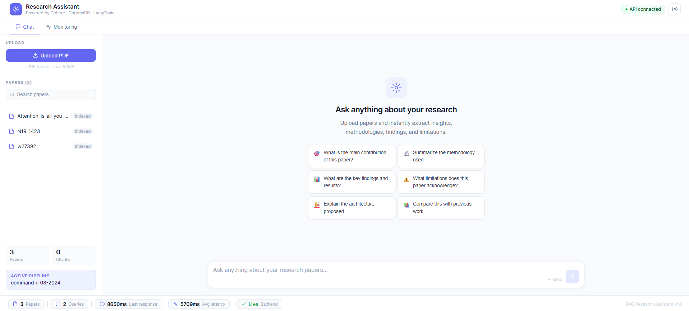
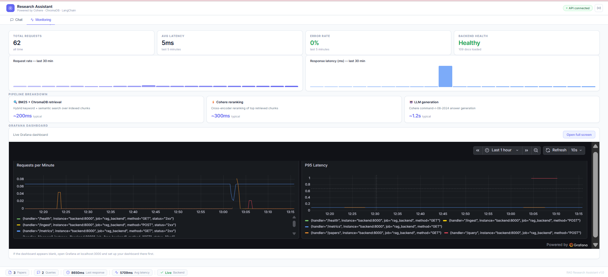

# 🔬 AI Research Assistant

A production-ready AI-powered research assistant that lets you upload academic papers and ask questions in plain English — getting cited, accurate answers in seconds.

Built with a full LLMOps stack: LlamaParse document parsing, hierarchical retrieval, Qdrant vector storage, reranking, real-time monitoring, model versioning, and Docker deployment.

---

## 📸 Screenshots





---

## 🚀 Quick Start

```bash
# 1. Clone the repository
git clone https://github.com/shivaniharane/research-assistant.git
cd research-assistant

# 2. Add your API keys
cp backend/.env.example backend/.env
# Edit backend/.env and set COHERE_API_KEY and LLAMA_PARSE_API_KEY

# 3. Start everything with one command
docker-compose up --build
```

Open your browser:

| Service | URL |
|---------|-----|
| App | http://localhost:5173 |
| API Docs | http://localhost:8000/docs |
| Prometheus | http://localhost:9090 |
| Grafana | http://localhost:3000 |
| Qdrant Dashboard | http://localhost:6333/dashboard |

---

## 🧠 What It Does

Upload any research paper (PDF) and ask questions like:
- *"What is the main contribution of this paper?"*
- *"Explain the methodology used."*
- *"What are the key findings and limitations?"*

The system retrieves the most relevant sections from the paper and generates a cited, accurate answer — including correct extraction of tables, formulas, and multi-column layouts.

---

## 🏗️ Architecture

```
User (React UI)
     │
     ├── POST /ingest ──► LlamaParse extraction
     │                     ├── Clean markdown, tables, structure preserved
     │                     ├── Hierarchical chunking:
     │                     │     ├── Parent chunks (2000 chars, full sections)
     │                     │     └── Child chunks (400 chars, precise search)
     │                     ├── Cohere embeddings (embed-english-v3.0)
     │                     └── Qdrant (parent_chunks + child_chunks collections)
     │
     └── POST /query ──► Hierarchical Hybrid Retrieval
                          ├── BM25 keyword search on child chunks
                          ├── Qdrant semantic search on child chunks
                          ├── Merge + dedupe, collect parent IDs
                          └── Batch fetch full parent chunks (one Qdrant call)
                               │
                               ▼
                          Cohere Reranker (top-3)
                               │
                               ▼
                          Cohere LLM (command-r-08-2024)
                               │
                               ▼
                          Answer + Sources + Latency

Observability:
  FastAPI /metrics ──► Prometheus ──► Grafana Dashboards
```

**Why hierarchical retrieval?** Searching small, precise child chunks finds the exact match, but returning only that fragment to the LLM often cuts off mid-explanation. Fetching the full parent section instead gives the LLM complete context every time — this was the single biggest accuracy improvement in the whole pipeline.

---

## 🛠️ Tech Stack

| Layer | Technology |
|-------|-----------|
| Frontend | React + Vite |
| Backend | FastAPI + Python |
| Document Parsing | LlamaParse |
| LLM | Cohere command-r-08-2024 |
| Embeddings | Cohere embed-english-v3.0 |
| Reranking | Cohere rerank-english-v3.0 |
| Vector Store | Qdrant |
| Keyword Search | BM25 |
| Monitoring | Prometheus + Grafana |
| Containerization | Docker + Docker Compose |

---

## ⚙️ LLMOps Features

### Model Versioning and Rollback

```bash
# See all versions
GET http://localhost:8000/models/versions

# Switch to experimental config
POST http://localhost:8000/models/switch/v2

# Roll back to stable config
POST http://localhost:8000/models/switch/v1
```

### Real-time Monitoring
- Request rate and P95 latency tracked via Prometheus
- Grafana dashboards embedded directly in the app
- `/metrics` endpoint auto-instrumented with prometheus-fastapi-instrumentator
- Metrics refresh every 15 seconds

### One-command Deployment

```bash
docker-compose up --build
```

Starts 5 containers: backend, frontend, Qdrant, Prometheus, Grafana.

---

## 📡 API Endpoints

| Method | Endpoint | Description |
|--------|----------|-------------|
| GET | /health | Health check + document count |
| GET | /papers | List all indexed papers |
| POST | /ingest | Upload and index a PDF |
| POST | /query | Ask a question |
| GET | /models/versions | List model versions |
| GET | /models/active | Get active configuration |
| POST | /models/switch/{version} | Switch version (rollback) |
| POST | /models/save | Save current config as version |
| GET | /metrics | Prometheus metrics |

---

## 📁 Project Structure

```
rag_research_assistant/
├── backend/
│   ├── app/
│   │   ├── config.py           # Environment-based settings
│   │   ├── ingestion.py        # LlamaParse + hierarchical chunking pipeline
│   │   ├── retriever.py        # Hybrid BM25 + Qdrant search, parent fetch
│   │   ├── reranker.py         # Cohere reranking
│   │   ├── chain.py            # LLM answer generation
│   │   └── main.py             # FastAPI application + endpoints
│   ├── versions/
│   │   ├── v1.json             # Stable configuration
│   │   ├── v2.json             # Experimental configuration
│   │   └── active.json         # Currently active version pointer
│   ├── data/
│   │   └── pdfs/                # Uploaded PDF files
│   ├── Dockerfile
│   └── requirements.txt
├── frontend/
│   ├── src/
│   │   ├── components/
│   │   │   ├── UploadPanel.jsx      # PDF upload + paper list
│   │   │   ├── ChatPanel.jsx        # Chat interface
│   │   │   ├── MonitoringPanel.jsx  # Live metrics dashboard
│   │   │   └── StatsBar.jsx         # Bottom metrics bar
│   │   ├── App.jsx
│   │   └── App.css
│   └── Dockerfile
├── monitoring/
│   └── prometheus.yml          # Prometheus scrape config
├── assets/
│   ├── chat-screenshot.png
│   └── monitoring-screenshot.png
├── docker-compose.yml           # backend, frontend, qdrant, prometheus, grafana
└── README.md
```

Qdrant's vector data persists in a named Docker volume (`qdrant_data`), not in the repo folder.

---

## 🔧 Environment Variables

| Variable | Default | Description |
|----------|---------|-------------|
| COHERE_API_KEY | required | Your Cohere API key |
| LLAMA_PARSE_API_KEY | required | Your LlamaParse API key |
| EMBEDDING_MODEL | embed-english-v3.0 | Cohere embedding model |
| RERANK_MODEL | rerank-english-v3.0 | Cohere reranking model |
| CHAT_MODEL | command-r-08-2024 | Cohere chat model |
| QDRANT_HOST | qdrant | Qdrant service hostname |
| QDRANT_PORT | 6333 | Qdrant service port |
| QDRANT_COLLECTION | rag_research | Base collection name |
| QDRANT_TOP_K | 5 | Qdrant semantic search results |
| QDRANT_WEIGHT | 0.7 | Qdrant retriever weight in fusion |
| BM25_TOP_K | 2 | BM25 keyword search results |
| BM25_WEIGHT | 0.3 | BM25 retriever weight in fusion |

---

## 🏃 Running Without Docker

**Backend:**

```bash
cd backend
python -m venv venv
venv\Scripts\activate
python -m pip install -r requirements.txt
uvicorn app.main:app --reload --host 0.0.0.0 --port 8000
```

Note: Qdrant must be running separately (e.g. `docker run -p 6333:6333 qdrant/qdrant`) for local development without Docker Compose.

**Frontend:**

```bash
cd frontend
npm install
npm run dev
```

---

## 💡 Key Design Decisions

**Why LlamaParse over pdfminer?**
Generic text extractors like pdfminer flatten tables into unstructured text and silently lose document layout. LlamaParse returns clean markdown with table structure and section headers intact — critical for research papers where results live in tables.

**Why hierarchical (parent-child) chunking?**
Small chunks retrieve precisely but often cut off mid-explanation. Large chunks preserve context but retrieve imprecisely. Searching small child chunks while returning their full parent section to the LLM gets both: precise retrieval and complete context.

**Why Qdrant over ChromaDB?**
ChromaDB is excellent for local prototyping but has no replication, clustering, or production-grade payload filtering. Qdrant ships with a web dashboard, supports horizontal scaling, and uses efficient payload filtering for the parent-chunk lookups this architecture depends on.

**Why hybrid retrieval?**
BM25 handles exact term matching (model names, metrics) while Qdrant's vector search handles semantic similarity. Combining both consistently outperforms either alone.

**Why reranking?**
Initial retrieval prioritizes recall — it casts a wide net. Cohere's cross-encoder reranker then scores each candidate against the query jointly, dramatically improving precision.

**Why RAG over fine-tuning?**
RAG keeps the LLM general-purpose and retrieves context at query time. Fine-tuning would require retraining every time a new paper is added — impractical for a dynamic corpus.

---

## 👩‍💻 Author

Built by **Shivani Harane** as part of a research assistantship in the MS Computer Science program.

**Get in touch:** [LinkedIn](https://linkedin.com/in/shivaniharane) · [GitHub](https://github.com/shivaniharane)